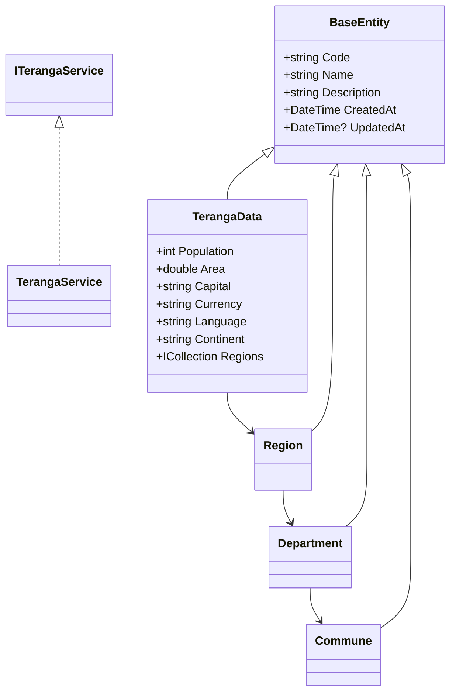

# Documentation Technique - Teranga.Core

## Table des matières
1. [Vue d'ensemble](#vue-densemble)
2. [Installation](#installation)
3. [Architecture](#architecture)
4. [Modèles de données](#modèles-de-données)
5. [Services](#services)
6. [Configuration](#configuration)
7. [Exemples d'utilisation](#exemples-dutilisation)
8. [Tests](#tests)
9. [Performance](#performance)
10. [Dépannage](#dépannage)

## Vue d'ensemble

Teranga.Core est un package NuGet qui fournit un accès aux données administratives du Sénégal. Il gère la hiérarchie complète des divisions administratives : régions, départements et communes.

### Caractéristiques principales
- Accès asynchrone aux données
- Thread-safe
- Zero-configuration
- Données embarquées
- Performance optimisée

### Prérequis
- .NET 8.0 ou supérieur
- Compatible avec :
  - ASP.NET Core
  - Blazor
  - Applications console
  - Applications desktop

## Installation

### Via NuGet Package Manager
```powershell
Install-Package Teranga.Core
```

### Via .NET CLI
```bash
dotnet add package Teranga.Core
```

### Configuration dans Program.cs
```csharp
using Teranga.Core.Extensions;

public void ConfigureServices(IServiceCollection services)
{
    services.AddTerangaCore();
}
```

## Architecture

### Structure du projet
```
Teranga.Core/
├── Models/
│   ├── BaseEntity.cs
│   ├── TerangaData.cs
│   ├── Region.cs
│   ├── Department.cs
│   └── Commune.cs
├── Interfaces/
│   └── ITerangaService.cs
├── Services/
│   └── TerangaService.cs
├── Extensions/
│   └── ServiceCollectionExtensions.cs
├── Exceptions/
│   └── TerangaException.cs
└── Data/
    └── teranga-data.json
```

### Diagramme de classes


## Modèles de données

### BaseEntity
```csharp
public abstract class BaseEntity
{
    public string Code { get; set; } = default!;
    public string Name { get; set; } = default!;
    public string? Description { get; set; }
    public DateTime CreatedAt { get; set; }
    public DateTime? UpdatedAt { get; set; }
}
```

### TerangaData
```csharp
public class TerangaData : BaseEntity
{
    public int Population { get; set; }
    public double Area { get; set; }
    public string Capital { get; set; } = default!;
    public string Currency { get; set; } = default!;
    public string Language { get; set; } = default!;
    public string Continent { get; set; } = default!;
    public virtual ICollection<Region> Regions { get; set; } = new List<Region>();
}
```

## Services

### ITerangaService
```csharp
public interface ITerangaService
{
    Task<TerangaData> GetTerangaDataAsync();
    Task<IEnumerable<Region>> GetAllRegionsAsync();
    Task<Region?> GetRegionByCodeAsync(string code);
    Task<IEnumerable<Department>> GetDepartmentsByRegionAsync(string regionCode);
    Task<Department?> GetDepartmentByCodeAsync(string code);
    Task<IEnumerable<Commune>> GetCommunesByDepartmentAsync(string departmentCode);
    Task<Commune?> GetCommuneByCodeAsync(string code);
}
```

## Configuration

Le service utilise une configuration par défaut sans nécessiter de paramétrage. Les données sont embarquées dans l'assembly.

### Personnalisation (optionnelle)
```csharp
services.AddTerangaCore(options =>
{
    // Futures options de configuration
});
```

## Exemples d'utilisation

### ASP.NET Core Controller
```csharp
[ApiController]
[Route("api/[controller]")]
public class RegionsController : ControllerBase
{
    private readonly ITerangaService _terangaService;

    public RegionsController(ITerangaService terangaService)
    {
        _terangaService = terangaService;
    }

    [HttpGet]
    public async Task<IActionResult> GetAllRegions()
    {
        var regions = await _terangaService.GetAllRegionsAsync();
        return Ok(regions);
    }

    [HttpGet("{code}")]
    public async Task<IActionResult> GetRegion(string code)
    {
        var region = await _terangaService.GetRegionByCodeAsync(code);
        return region != null ? Ok(region) : NotFound();
    }
}
```

### Blazor Component
```csharp
@inject ITerangaService TerangaService

<select @onchange="OnRegionSelected">
    @foreach (var region in regions)
    {
        <option value="@region.Code">@region.Name</option>
    }
</select>

@code {
    private IEnumerable<Region> regions = new List<Region>();

    protected override async Task OnInitializedAsync()
    {
        regions = await TerangaService.GetAllRegionsAsync();
    }

    private async Task OnRegionSelected(ChangeEventArgs e)
    {
        var departments = await TerangaService.GetDepartmentsByRegionAsync(e.Value.ToString());
        // Traitement des départements
    }
}
```

## Tests

### Tests unitaires
```csharp
public class TerangaServiceTests
{
    private readonly ITerangaService _service;

    public TerangaServiceTests()
    {
        var logger = new Mock<ILogger<TerangaService>>();
        _service = new TerangaService(logger.Object);
    }

    [Fact]
    public async Task GetRegionByCode_ShouldReturnRegion()
    {
        var region = await _service.GetRegionByCodeAsync("DK");
        Assert.NotNull(region);
        Assert.Equal("Dakar", region.Name);
    }
}
```

### Tests de performance
```csharp
[Fact]
public async Task PerformanceTest_MultipleRequests()
{
    var stopwatch = Stopwatch.StartNew();
    var tasks = new List<Task>();

    for (int i = 0; i < 1000; i++)
    {
        tasks.Add(_service.GetAllRegionsAsync());
    }

    await Task.WhenAll(tasks);
    stopwatch.Stop();

    Assert.True(stopwatch.ElapsedMilliseconds < 1000);
}
```

## Performance

### Métriques de performance
- Chargement initial : < 100ms
- Requêtes simples : < 10ms
- Requêtes complexes : < 50ms
- Utilisation mémoire : < 10MB

### Optimisations
- Données en mémoire
- Thread-safe avec minimal locking
- Recherche optimisée par code

## Dépannage

### Erreurs communes

1. TerangaException : "Data not loaded"
```csharp
try
{
    var data = await _service.GetTerangaDataAsync();
}
catch (TerangaException ex)
{
    // Le service n'est pas correctement initialisé
}
```

2. ArgumentException : Code invalide
```csharp
try
{
    var region = await _service.GetRegionByCodeAsync("");
}
catch (ArgumentException ex)
{
    // Code région invalide
}
```

### Logging
Le service utilise ILogger pour la journalisation :
```csharp
services.AddLogging(builder =>
{
    builder.AddConsole();
    builder.AddDebug();
});
```

## Meilleures pratiques

1. Injection de dépendances
```csharp
// ✅ Bon
services.AddTerangaCore();
constructor(ITerangaService service)

// ❌ Mauvais
var service = new TerangaService();
```

2. Gestion des exceptions
```csharp
// ✅ Bon
try
{
    var region = await service.GetRegionByCodeAsync(code);
    if (region == null) return NotFound();
}
catch (Exception ex)
{
    logger.LogError(ex, "Error getting region");
    return StatusCode(500);
}

// ❌ Mauvais
var region = await service.GetRegionByCodeAsync(code);
return Ok(region);
```

